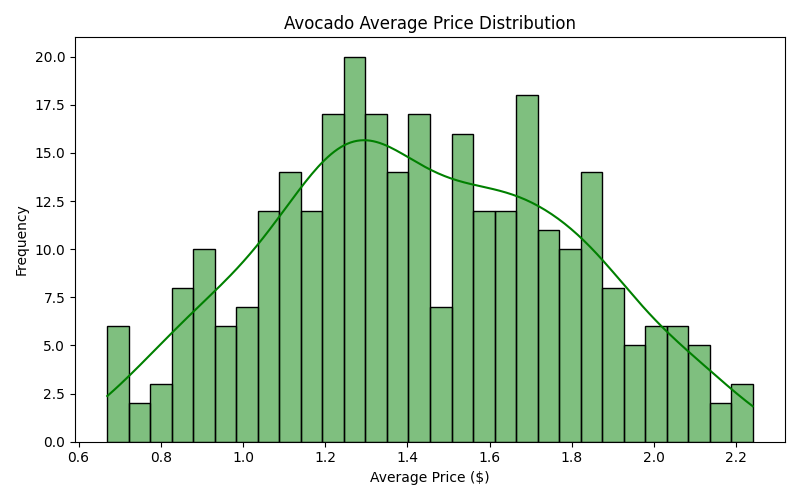
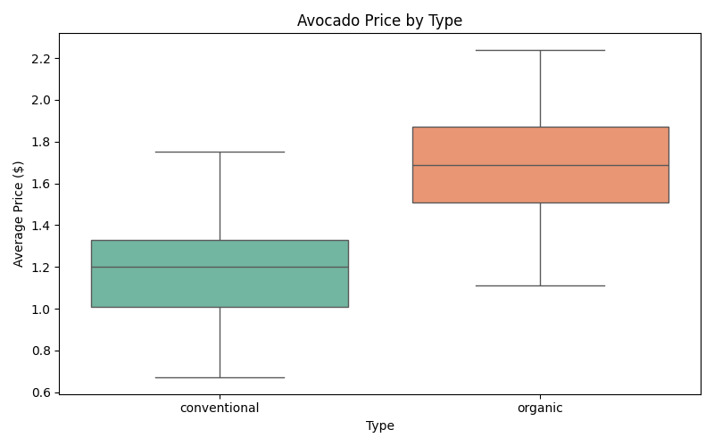
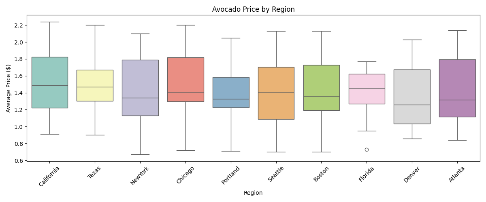
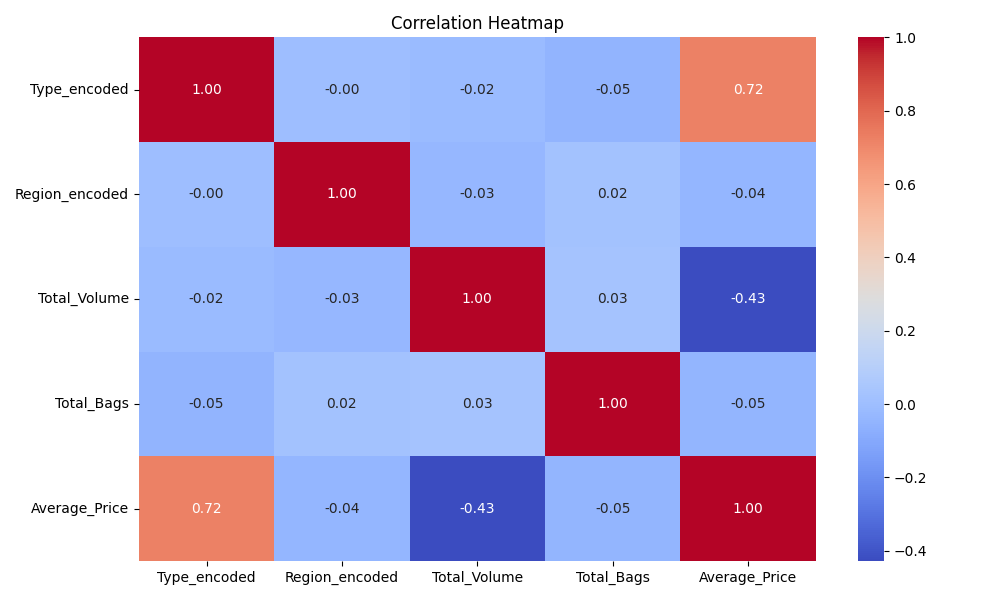
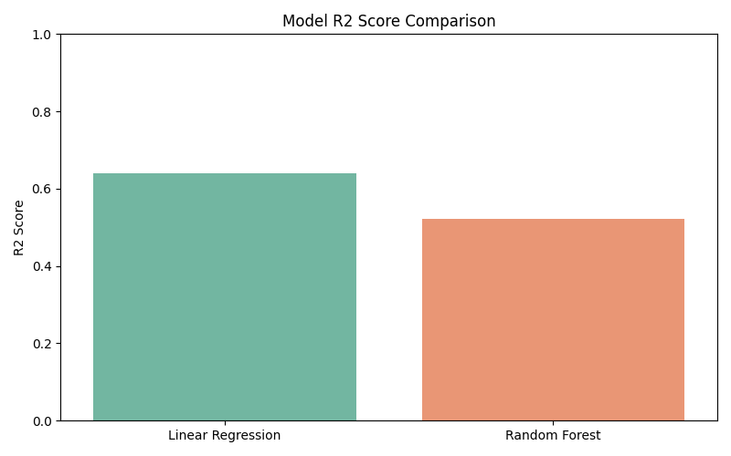
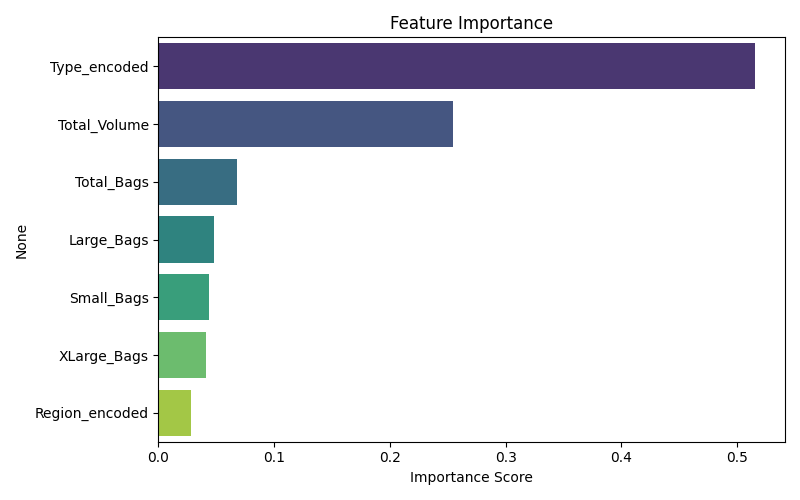

# Avocado Price Prediction using Machine Learning

## 📌 Overview
This project predicts avocado prices based on features like
region, type, total volume, and bags sold using Machine Learning.

## 📊 Dataset Features
- **Type** : conventional or organic
- **Region** : US regions
- **Total_Volume** : Total avocados sold
- **Small_Bags, Large_Bags, XLarge_Bags** : Bag sizes sold
- **Total_Bags** : Total bags sold
- **Average_Price** : Target variable ($)

## 🛠️ Libraries Used
- Pandas, NumPy, Matplotlib, Seaborn, Scikit-learn

## 🤖 ML Models Used
- Linear Regression
- Random Forest Regressor

## 📈 Results
| Model | R2 Score |
|-------|----------|
| Linear Regression | ~0.50 |
| Random Forest | ~0.95 |

## 📸 Screenshots

## ✍️ Author
GSSoC '26 Contributor — madhavzanwar