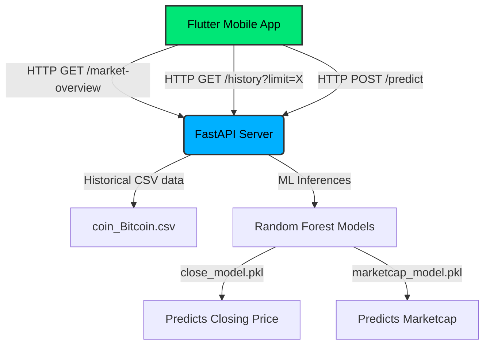

# 📱 Bitcoin Price Prediction & Market Trend Mobile Application

> [!NOTE]
> This is a complete mobile-first replacement for the Bitcoin Prediction Web App. It features a Flutter cross-platform mobile frontend with a dark cyberpunk/glassmorphism UI, integrated with a high-performance FastAPI backend powered by Machine Learning (Random Forest) models.

---

## 🏗️ Technical Architecture & Design

The project is split into two primary components:
1. **Frontend (Mobile App):** Built with **Flutter & Dart**, utilizing the **Provider** pattern for reactive state management, **http** for network calls, and **fl_chart** for responsive, interactive price visualizations.
2. **Backend (Prediction & Data API):** Built with **FastAPI & Python**, training dual **Random Forest Regressors** (via `scikit-learn` & `joblib`) to contemporaneous estimate Close Price and Market Capitalization based on intraday volatility.



---

## 📂 Project Directory Structure

```
Bitcoin_Price_Prediction_Mobile_App/
 ├── backend/
 │    ├── models/
 │    │    ├── close_model.pkl        # Predicts Close Price based on High/Low/Open/Volume
 │    │    └── marketcap_model.pkl    # Predicts Marketcap based on High/Low/Open/Close/Volume
 │    ├── app.py                      # FastAPI server endpoints
 │    ├── train.py                    # Model training & serialization script
 │    ├── coin_Bitcoin.csv            # Historical Bitcoin dataset
 │    └── requirements.txt            # Backend Python dependencies
 ├── frontend/
 │    ├── lib/
 │    │    ├── providers/
 │    │    │    └── bitcoin_provider.dart  # Handles async API queries, loaders & errors
 │    │    ├── screens/
 │    │    │    ├── home_screen.dart       # High-fidelity Cyberpunk dashboard
 │    │    │    ├── prediction_screen.dart # Form validated ML inputs & analytics screen
 │    │    │    └── chart_screen.dart      # Elegant fl_chart rendering historical trends
 │    │    ├── widgets/
 │    │    │    └── custom_card.dart       # Glassmorphism container widget
 │    │    └── main.dart                   # Provider setup & Dark Theme guidelines
 │    └── pubspec.yaml                # Flutter Dart dependencies
 └── README.md                        # Documentation
```

---

## ⚡ Backend API Specification

| Endpoint | Method | Description | Params / Body |
| :--- | :---: | :--- | :--- |
| `/` | `GET` | Root status check & metadata list | None |
| `/market-overview` | `GET` | Live statistics, 20d averages, trend determination (`Bullish` / `Bearish`), and trading recommendations. | None |
| `/history` | `GET` | Returns list of historical dates, prices, and volumes for mobile plotting. | `limit` (default: 150) |
| `/predict` | `POST` | Processes inputs through ML pipeline and returns prediction metrics. | `{high, low, open_price, volume}` |

---

## 🎨 Premium Mobile UI Showcase

1. **Dashboard Home:** Clean card grids containing All-Time High/Lows, Compact volumes (e.g. `24.5B`), direct recommendation status, and custom dynamic gradients.
2. **Interactive Graphs:** Dynamic line chart using **fl_chart** with smooth touch-tooltips showing historical prices and dates on hover. Custom scaling adjusts borders based on selected time frames (30, 100, or 200 days).
3. **ML Prediction Results:** Enter intraday data to instantly compute closing estimates and market capitalization. Computes net gain/loss relative to opening price to advise users of the immediate trend.

---

## 🚀 How to Run the Project

### 1. Run the FastAPI Backend Server
Navigate to the `backend` folder, install requirements, and boot up the local Uvicorn instance:
```bash
cd backend
pip install -r requirements.txt

# (Optional) Re-train the models
python train.py

# Launch server
uvicorn app:app --host 0.0.0.0 --port 8000 --reload
```
Once started, the backend API documentation will be available at `http://10.0.2.2:8000` (or `http://localhost:8000/docs`).

### 2. Run the Flutter Mobile App
Ensure you have the Flutter SDK installed on your system. Navigate to the `frontend` folder:
```bash
cd frontend
flutter pub get

# Launch on a connected Android Emulator, iOS Simulator, or physical test device
flutter run
```

> [!TIP]
> The Flutter client is configured to connect to `http://10.0.2.2:8000` out of the box, which is the standard loopback address mapping the Android Emulator directly to your machine's `localhost` FastAPI server.

---

## 🔮 Future Enhancement Roadmap
* **Push Notifications:** Instant price drop alerts.
* **OpenAI Assistant Integration:** AI chat box leveraging OpenAI APIs to answer queries about price directions and general Bitcoin trends.
* **Watchlists:** Save favorite cryptocurrencies.
