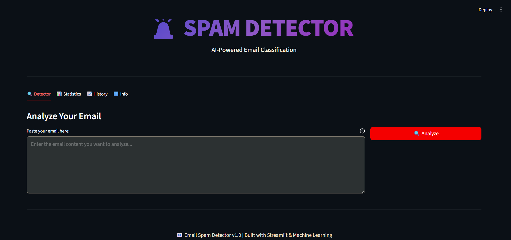
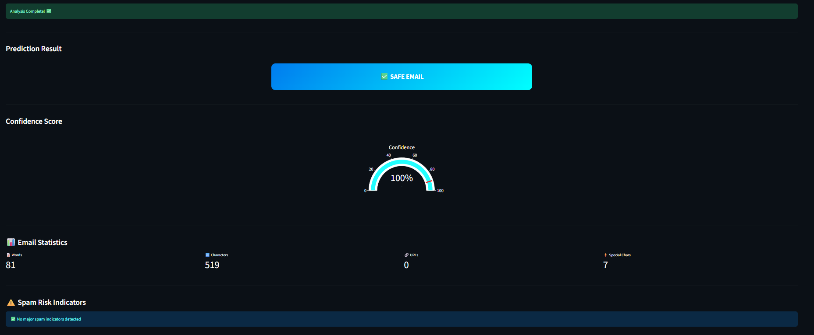

# 📧 Email Spam Classifier

## GOAL

The goal of this project is to predict whether an email is **Spam** or **Not Spam (Ham)** using Machine Learning techniques.

Dataset can be downloaded from [here](https://www.kaggle.com/ozlerhakan/spam-or-not-spam-dataset).

---

## MODELS USED

* Decision Tree Classifier
* Multinomial Naive Bayes

---

## LIBRARIES NEEDED

* numpy
* pandas
* scikit-learn
* streamlit

---

## MODEL PERFORMANCE

### Multinomial Naive Bayes

```text
Accuracy of training data: 94.33962264150944
Accuracy of testing data: 92.49422632794457
```

### Decision Tree Classifier

```text
Accuracy of training data: 100.0
Accuracy of testing data: 97.57505773672055
```

The Decision Tree model achieved the highest testing accuracy and was selected for deployment in the Streamlit application.

---

## STREAMLIT WEB APPLICATION

A user-friendly Streamlit web application has been added to allow users to classify emails in real time.

### Features

* Email Spam Detection
* Interactive Web Interface
* Confidence Score Display
* Fast Predictions
* Easy-to-use Interface

---

## INSTALLATION

### Clone the Repository

```bash
git clone https://github.com/Niketkumardheeryan/ML-CaPsule.git
```

### Navigate to the Project Directory

```bash
cd "Email Classifier"
```

### Install Dependencies

```bash
pip install -r requirements.txt
```

---

## TRAIN THE MODEL

Run the following command:

```bash
python train_model.py
```

This will generate:

```text
model.pkl
vectorizer.pkl
```

---

## RUN THE APPLICATION

```bash
streamlit run app.py
```

---

## PROJECT STRUCTURE

```text
Email Classifier/
│
├── Emails_spam_or_not.ipynb
├── spam_or_not_spam.csv
├── train_model.py
├── app.py
├── model.pkl
├── vectorizer.pkl
├── requirements.txt
├── README.md

```

---

## SCREENSHOTS

### Home Page



### Prediction Result



---

## CONTRIBUTORS

### Original Project Author

<a href="https://github.com/Jagannath8">Jagannath Pal</a>

### Streamlit Web Application Enhancement

<a href="https://github.com/MahiPradhi1">MahiPardhi1</a>

---
