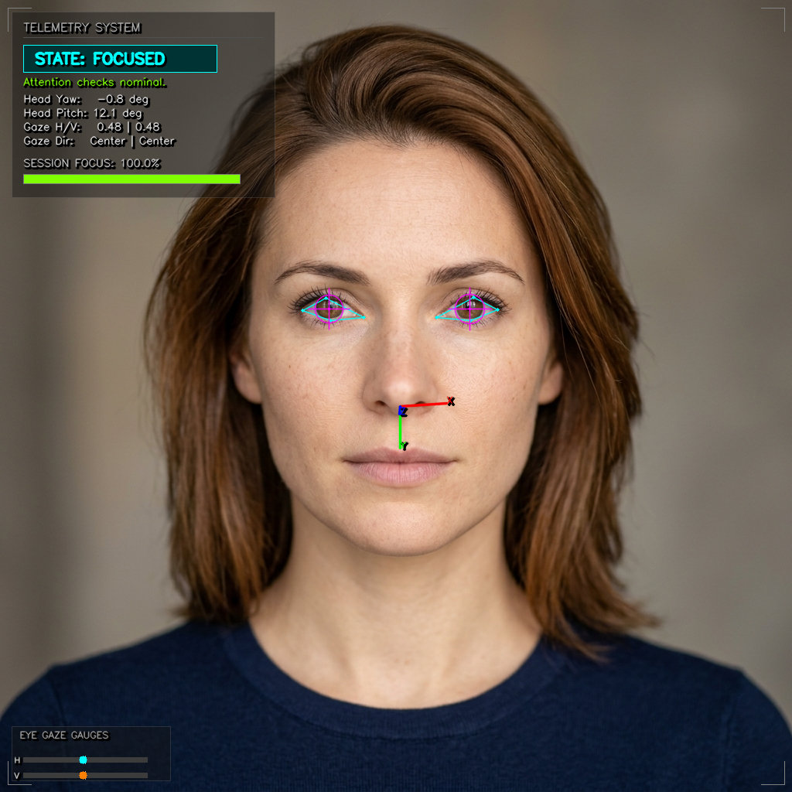

# Real-Time Eye Gaze Tracking & Attention Estimation

Real-time computer vision system that tracks human eye gaze and head pose to estimate attention levels (Focused vs. Distracted) using the modern MediaPipe FaceMesh Tasks API, Perspective-n-Point camera matrix algebra, and Exponential Moving Average smoothing.

The project features a **Cyber-Tech Telemetry HUD** visualization console overlaid directly on the video feed to display live metrics, eye crosshair targets, vertical/horizontal gauge meters, and session focus percentage tracking.

---

## 🎬 Visual Demonstration

### Simulated Multi-State Attention Tracking
Below is an animated loop demonstrating the 7 simulated tracking states generated via the headless verification suite. Observe the glowing pupil crosshairs, 3D coordinate axes, and sliding dashboard gauges adjusting to gaze and head movements:


### Telemetry Dashboard Static View
Here is the static high-fidelity telemetry HUD rendered on a centered portrait:



---

## ✨ Features

- **Robust Pupil Center Tracking**: Isolates anatomical left/right irises and eyelid geometries via MediaPipe FaceMesh.
- **Rotation-Invariant Gaze Projection**: Employs mathematical vector projections of pupil positions relative to eyelid coordinates to maintain perfect tracking accuracy even during head tilts (roll).
- **3D Head Pose Estimator**: Leverages OpenCV's `solvePnP` to estimate Pitch, Yaw, and Roll by mapping 2D landmarks to a generic 3D face model, rendering a projected 3D coordinate coordinate axis from the nose tip.
- **Temporal State Classifier**: Fuses head angles and gaze ratios using an Exponential Moving Average (EMA) and a customizable grace period buffer (e.g., 1.5 seconds) to classify attention states (Focused vs. Distracted) while filtering out brief blinks.
- **Interactive Telemetry HUD**: Includes glowing contour rendering, crosshairs, gauges, and a real-time Focus Index score.
- **Automated Verification Pipeline**: A headless simulation script that validates all package modules on reference images and generates animations.
- **Interactive Walkthrough**: A complete, mathematically rich Jupyter Notebook tutorial for students and developers.

---

## 🧠 Theory & Mathematics

### 1. Vector Gaze Projection
Rather than computing simple coordinate ratios ($x / w$) which drift during head roll (tilt), we project the pupil center vector onto the eye's horizontal and vertical coordinate axes:

Let $\vec{p}_{left}$ and $\vec{p}_{right}$ be the coordinates of the eye corners. The eye's horizontal axis vector is:
$$\vec{u} = \vec{p}_{right} - \vec{p}_{left}$$

The vector from the left corner to the pupil center $\vec{p}_{iris}$ is:
$$\vec{v} = \vec{p}_{iris} - \vec{p}_{left}$$

The normalized horizontal gaze ratio $t_h$ is the dot product projection:
$$t_h = \frac{\vec{v} \cdot \vec{u}}{\|\vec{u}\|^2}$$

- **$t_h \approx 0.5$**: Eyes are looking straight centered.
- **$t_h < 0.38$**: Eyes are looking to the user's right (screen-left).
- **$t_h > 0.62$**: Eyes are looking to the user's left (screen-right).

A matching projection is solved vertically to compute vertical gaze ratio $t_v$.

### 2. 3D Head Pose Estimation (Perspective-n-Point)
Head angles are solved by finding the rotation matrix $R$ and translation vector $T$ that projects 3D facial coordinate landmarks (nose tip, eyes, chin, mouth corners) into 2D camera pixels:

$$s \begin{bmatrix} u \\ v \\ 1 \end{bmatrix} = K \begin{bmatrix} R & | & T \end{bmatrix} \begin{bmatrix} X_w \\ Y_w \\ Z_w \\ 1 \end{bmatrix}$$

Decomposing $R$ yields the Euler angles:
- **Yaw (rotation about Y)**: Positive = turning left, Negative = turning right.
- **Pitch (rotation about X)**: Positive = nodding up, Negative = nodding down.
- **Roll (rotation about Z)**: Tilt angle.

---

## 📁 Repository Structure

```directory
Eye_Gaze_Tracking_Attention_Estimation/
├── gaze_tracker/
│   ├── __init__.py
│   ├── detector.py              # MediaPipe Tasks Face Mesh wrapper & vector math
│   ├── pose_estimator.py        # 3D solvePnP head angle solver & projection
│   ├── attention_classifier.py  # EMA smoothing, decision state machine & stats
│   ├── utils.py                 # Premium HUD dashboard & 3D axes overlay drawings
│   └── face_landmarker.task     # Auto-downloaded MediaPipe model file
├── sample_output/
│   ├── portrait_face.png        # Input generated face portrait
│   ├── portrait_gaze_annotated.png # Final static dashboard HUD reference
│   └── gaze_tracking_demo.gif   # Multi-state animated simulation loop
├── requirements.txt             # Project dependencies
├── main.py                      # Real-time webcam tracker executable
├── validate_pipeline.py         # Headless verification & animation generator
└── Gaze_Tracking_Walkthrough.ipynb # Explanatory Jupyter Notebook tutorial
```

---

## 🚀 Quick Start

### 1. Installation
Clone the repository and install the dependencies. The system requires Python 3.9+ (fully compatible with Python 3.14):

```bash
# Navigate to the project directory
cd Eye_Gaze_Tracking_Attention_Estimation

# Install required packages
pip install -r requirements.txt
```

### 2. Running Real-Time Webcam Tracker
Start the live webcam feed with default thresholds:

```bash
python main.py
```

Press **Q** or **ESC** inside the video window to stop the tracking and display session statistics.

#### Customizable Flags:
- `--source`: Specify a video file path or camera index (default: `0` for system webcam).
- `--yaw-thresh`: Custom maximum yaw rotation threshold (default: `18.0` degrees).
- `--pitch-thresh`: Custom maximum pitch nodding threshold (default: `15.0` degrees).
- `--distraction-thresh`: Grace period in seconds before marking distraction (default: `1.5` seconds).
- `--ema-alpha`: Smoothing weight coefficient (default: `0.15`).
- `--no-eye-mesh`: Hide eye crosshair targets and eyelid overlays.
- `--no-pose-axis`: Hide the 3D projected coordinate axis lines.

Example with custom strict thresholds:
```bash
python main.py --source 0 --yaw-thresh 12.0 --pitch-thresh 10.0 --distraction-thresh 1.0
```

### 3. Running Headless Simulation & Asset Builder
To test modules and recreate the static and animated visual assets without a webcam:

```bash
python validate_pipeline.py
```

### 4. Running Jupyter Notebook Walkthrough
To learn the concepts interactively:

```bash
jupyter notebook Gaze_Tracking_Walkthrough.ipynb
```
