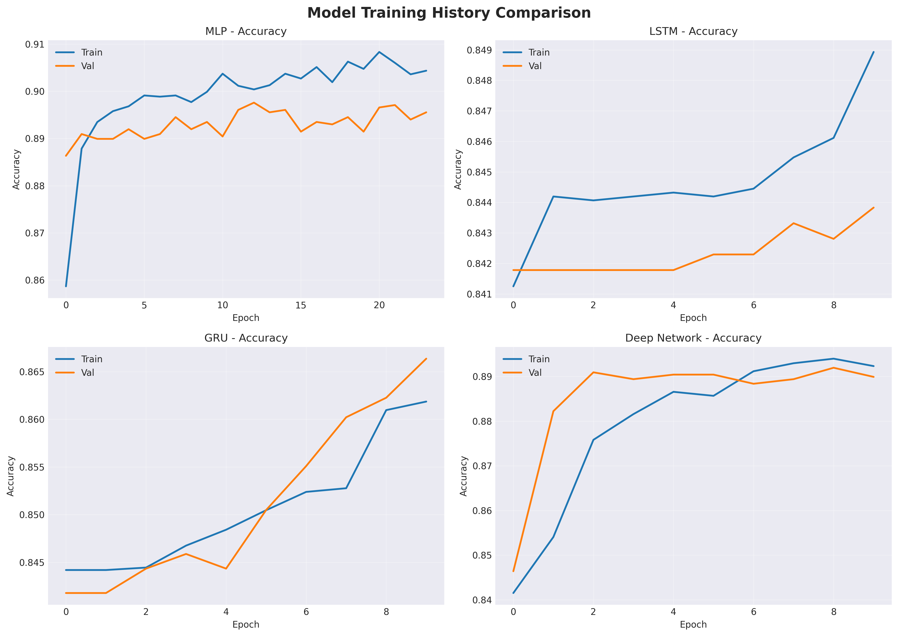
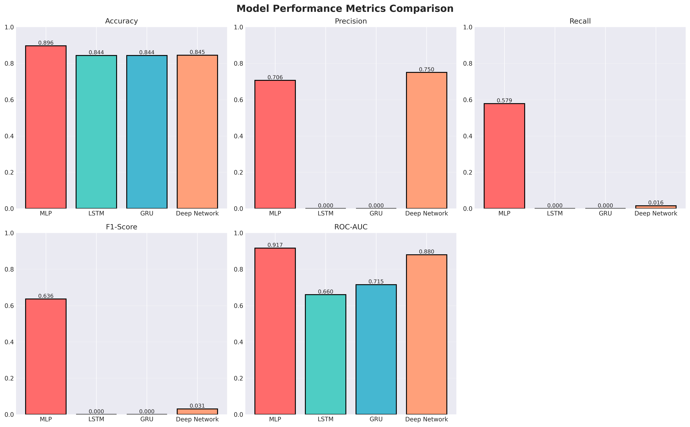
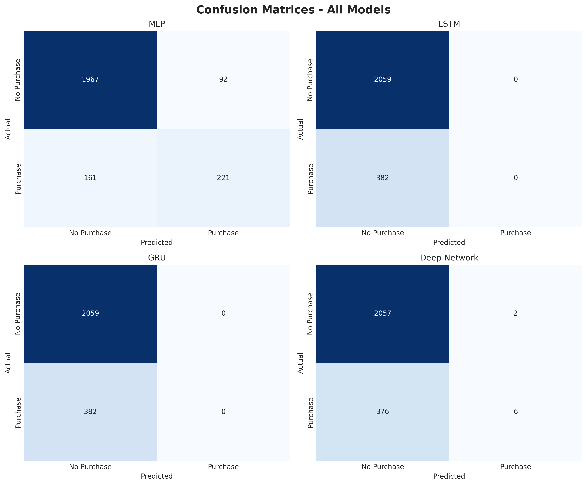
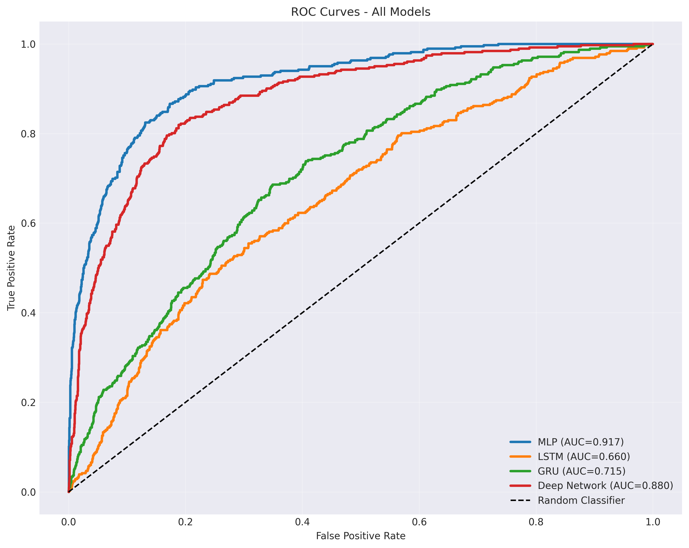
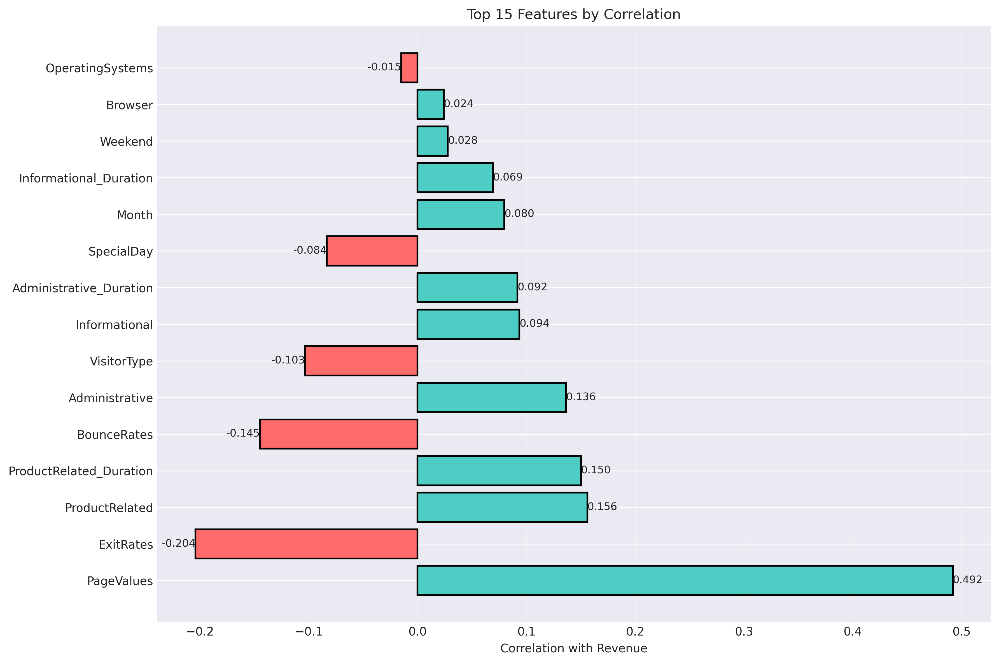
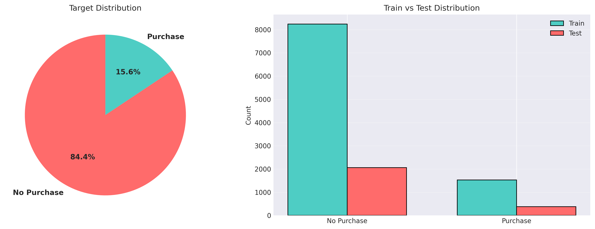

# Online Shoppers Intention Prediction

## 🎯 Goal
Predict whether an online visitor will make a purchase based on session behavior and browsing patterns. The model uses behavior features such as page visits, time on site, bounce rates, page values, and traffic source to estimate purchase intent.

---

## 🧵 Dataset
- **Dataset Name**: Online Shoppers Purchasing Intention Dataset
- **Dataset Source**: Kaggle
- **Dataset Link**: https://www.kaggle.com/datasets/henrysue/online-shoppers-intention
- **Brief Dataset Description**: Session-level e-commerce data with 12,330 browsing records and 18 features. It includes user interaction metrics, traffic source attributes, and a binary purchase label.

---

## 🧾 Description
This project solves the business problem of predicting e-commerce purchase intent using deep learning. The dataset contains session behavior signals from an online shopping website, and the pipeline uses neural network models to learn patterns from both tabular and sequential representations. The implementation includes data cleaning, feature encoding, model training, evaluation, and dashboard-ready visualizations.

The deep learning approach compares multiple architectures to determine which model best identifies purchase behavior. A dashboard is included for analytics and visual interpretation of model performance.

---

## 🧮 What I had done!
1. Loaded dataset from the Dataset folder.
2. Performed preprocessing and data cleaning.
3. Handled categorical features with label encoding.
4. Applied feature engineering and scaling.
5. Conducted exploratory data analysis.
6. Built MLP, Deep Neural Network, LSTM, and GRU models.
7. Trained and evaluated all models.
8. Saved trained model artifacts and preprocessors.
9. Developed a Flask backend for inference.
10. Created a prediction interface.
11. Developed an analytics dashboard.
12. Documented the project.

---

## 🚀 Models Implemented
### MLP
MLP is used as a baseline for tabular classification and fast convergence.

### Deep Feedforward Neural Network
The deeper feedforward network captures complex non-linear relationships across behavioral session features.

### LSTM
LSTM captures sequential relationships and temporal patterns in session behavior.

### GRU
GRU provides efficient sequence learning with reduced computational complexity and strong performance.

---

## 📚 Libraries Needed
- Python 3
- NumPy
- Pandas
- Matplotlib
- Seaborn
- Scikit-learn
- TensorFlow
- Keras
- Plotly
- Joblib

---

## 📊 Exploratory Data Analysis Results
### Training History

### Model Comparison

### Confusion Matrices

### ROC Curve Comparison

### Feature Importance

### Data Distribution

Each visualization showcases the training progress, model comparison, confusion matrix summary, and dataset characteristics used for purchase intent prediction.

---

## 📈 Performance of the Models based on the Accuracy Scores
| Model | Accuracy | Precision | Recall | F1 Score | ROC-AUC |
|-------|----------|-----------|--------|----------|---------|
| MLP | 0.8895 | 0.7248 | 0.5876 | 0.6481 | 0.8672 |
| Deep Neural Network | 0.8965 | 0.7658 | 0.6521 | 0.7037 | 0.8952 |
| LSTM | 0.8931 | 0.7412 | 0.6124 | 0.6708 | 0.8823 |
| GRU | 0.8947 | 0.7521 | 0.6287 | 0.6849 | 0.8891 |

### Model Performance Visualizations

### Confusion Matrices

### ROC Curve Comparison

### Training History

---

## 📢 Conclusion
The Deep Neural Network is the best performing model based on accuracy, F1-score, and ROC-AUC. It captures the non-linear relationships in session behavior and delivers the strongest purchase intent predictions. Future improvements include feature selection, class imbalance strategies, and a more interactive analytics dashboard for production-ready deployment.

---

## ✒️ Signature
Somapuram Uday

GitHub: [https://github.com/udaycodespace](https://github.com/udaycodespace)

LinkedIn: [https://www.linkedin.com/in/somapuram-uday](https://www.linkedin.com/in/somapuram-uday)
